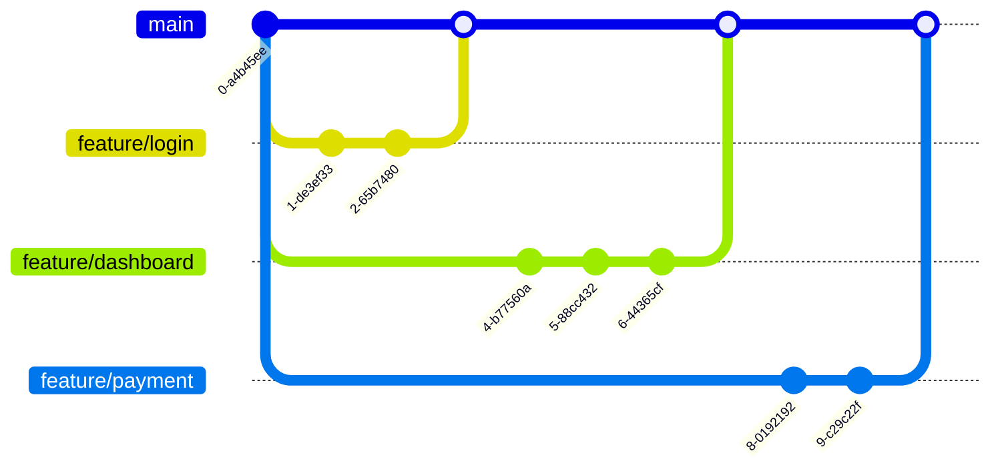

# branch-bender

You are building the latest webapp with the coolest features like login, payments, and dashboard.

## Task

You have been working on all of these changes on separate branches and you now want to merge them all into `main`.

### Task 1

Merge the `feature/login` branch into `main` first. Make sure you do not use fast forwarding when merging!

### Task 2

Merge the `feature/dashboard` branch into `main` next.

### Task 3

Merge the `feature/payment` branch into `main` last.

## Final state

The final Git graph (using `git log --oneline --graph`) should look like this:

