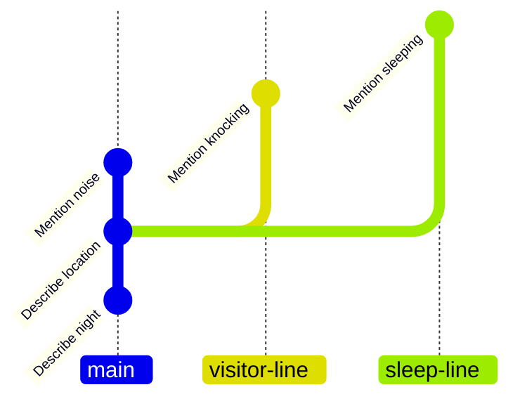

# branch-previous

You are writing the outline for a story, in `story.txt`.

You have written the first few steps of the storyline.

You are not very happy with the way the story is progressing, and wish to explore a few alternative storylines starting from a previous step.

## Task

1. Start a new branch named `visitor-line`, starting from the second commit (i.e., commit `Add second line`).
2. Add the line `I heard someone knocking at the door`. to the `story.txt`.
3. Commit the change. You may use any suitable commit message.
4. Start a new branch named `sleep-line`, starting from the same starting point as before.
5. Add the line `I fell asleep on the couch`. to the `story.txt`.
6. Commit the change. You may use any suitable commit message.

## Expected Revision Graph

