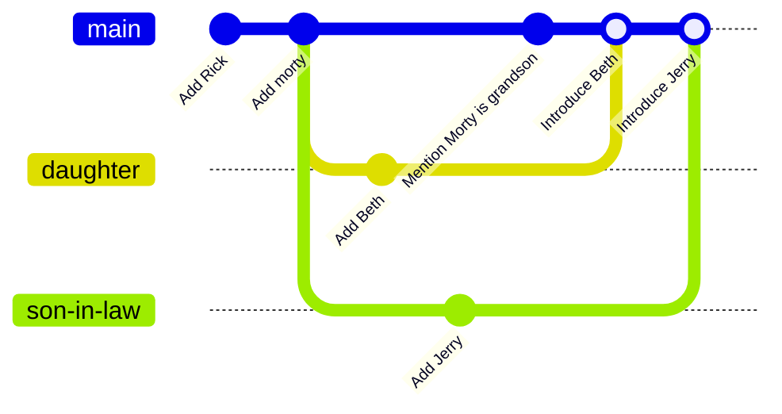
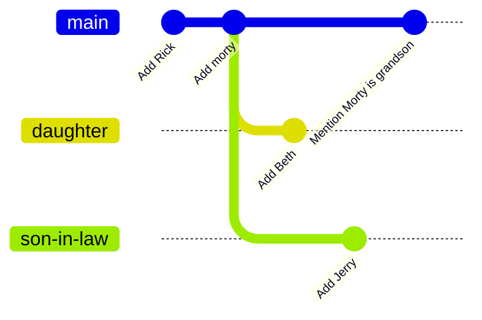

# merge-undo

Scenario: You are keeping notes on the characters of a play that you are writing. In the main story line (which is in the `main` branch), you introduced two characters, Rick and Morty. You had two other characters in two separate branches `daughter` and `son-in-law`. Just now, you introduced these two characters to the main story line by merging the two branches to the `main` branch.

However, now you realise this is premature, and wish to undo that change.

## Task

Undo the merging of branches `son-in-law` and `daughter`.

The result should be as follows:

