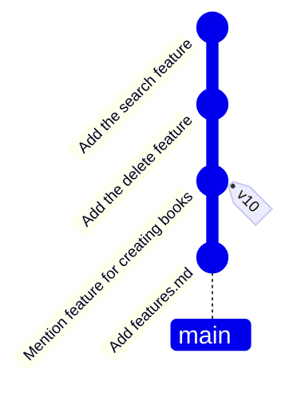

# mix-messy-graph

You are writing user documentation for a product. You have already written documentation for a few new features, each in a separate branch. After merging the `feature-search` branch, you realise this way of merging can result in a complicated revision graph. Instead, you wish to merge these changes in a way that results in a simple linear revision graph.

## Task

1. Undo the merging of `feature-search`.
2. Squash-merge the `feature-search` branch onto the `main` branch. Delete the `feature-search` branch.
3. Similarly, squash-merge and delete the `feature-delete` branch, while resolving any merge conflicts -- in the `features.md`, the delete feature should appear after the search feature. 
4. The `list` branch is not needed, as you have decided not to have that feature. Delete that branch.

The resulting revision graph should be as follows:

